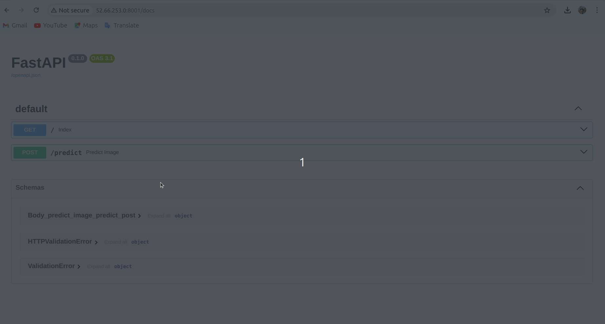

# ModelAPI
Demo project for deployment of ML models using FastAPI.

## Prerequisites
1. Python 3.x
2. pip (Python package manager)

## Install FastAPI
1. Create a Python virtual environment.
   ```
   python3 -m venv model_api_env
2. Activate newly created venv.
   ```
   source model_api_env/bin/activate
3. Install FastAPI.
   ```
   pip install fastapi

## Configure cloud environment 
1. Edit Inbound rules in cloud environment and enable a port for ModelAPI deployment.
2. Allow inbound traffic in the OS firewall.
   ```
   sudo ufw allow <PORT>
   ```
   
## Configure and Run ModelAPI
1. Clone ModelAPI.
   ```
   git clone https://github.com/pramit-d/ModelAPI
2. Install all the required Python packages.
   ```
   cd ModelAPI
   pip install -r requirements.txt
   
3. Run ModelAPI.
   ```
   uvicorn main:app --host 0.0.0.0 --port <PORT>

## Access and Use ModelAPI
1. Access ModelAPI:
   ```
   <VM_IP_ADDRESS>:<PORT>
2. Interactive API docs:
   ```
   <VM_IP_ADDRESS>:<PORT>/docs
   ```
   You will see the automatic interactive API documentation (provided by Swagger UI).
3. Use ModelAPI to predict images.

   

   It will predict an image from the mentioned list.
   `[airplane, automobile, bird, cat, deer, dog, frog, horse, ship, truck]`
   
